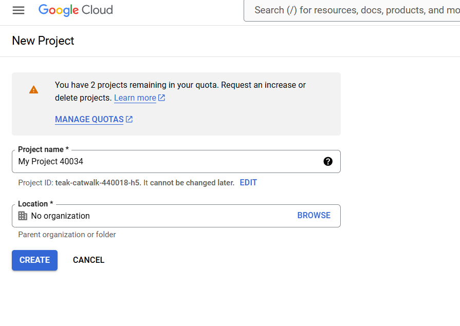
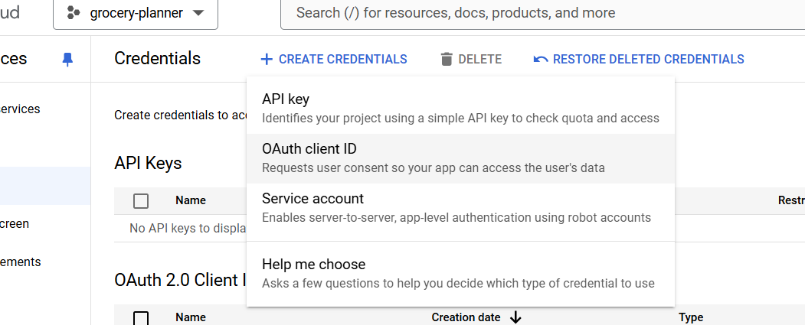
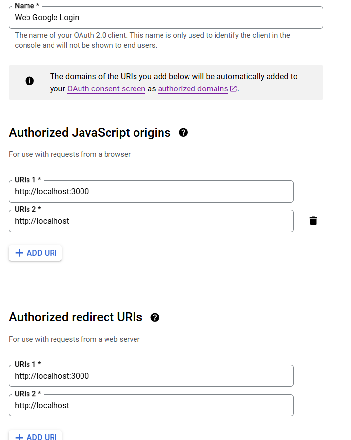

# Signup / Signin with google

## Libraries used

On FE:

- `@react-oauth/google@latest` for google auth

On BE:

- `bcrypt` for password hashing
- `google-auth-library` for google auth
- `jsonwebtoken` for token generation

## Setting up project on google cloud

1. Go to [Google Cloud Console](https://console.cloud.google.com/) and create a new project. Or directly go to [this link](https://console.cloud.google.com/projectcreate) to create a new project.

2. Select the project from top left dropdown.
3. Go to `APIs & Services` -> `Credentials` and fill the required details.
4. You will most likely be asked to fill out the "OAuth Consent Screen" form. If not, go to point 8.
5. This form is all about the information that the user sees in the “Sign In With Google” popup window. On the first screen, choose “External”. Hit “Create” and move to the next screen.
6. Fill out the form with the required information. You can skip the optional fields. Fill your own email where required.
7. After saving, go to the “Credentials” tab.
8. click “Create Credentials” -> “OAuth client ID”.

9. Select the correct application type: “Web application”.
10. Fill out the form to create the credentials. Make sure you put in both localhost & localhost:3000

11. Copy the client ID and use in the env file of react project against `REACT_APP_GOOGLE_LOGIN_CLIENT_ID`.
